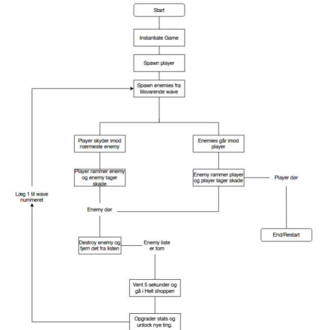

# EksamensProjekt (Infernal Survivors)
Der skal være en player som kæmper mod en sværm af enemies
Playeren skal skyde modstanderne og kunne samle xp op som de dropper
Ud fra det skal han kunne levele op
Når han leveler op kan han opgradere mellem forskellige ting
Der skal være waves som gradvist bliver sværer
Der må gerne være nogle abilities som du kan unlockes

## Actors

|ID|Actor|Description|
|---|---|---|
|0|Player|Spilleren som spiller spillet|
|1|Enemy|Modstanderen som targeter playeren|
|2|Projectile|Genstanden som skydes mod enemies|
|3|Soul|Valutaen som bruges til at opgradere|

### Player
Spilleren er et prefab i unity der instantieres af gamecontroller i punkt 0,0,0. Spilleren har to våben. Et standard projektil og et special attack med en AOE effekt. Spilleren har en health og en stamina bar. Når healthbaren rammer 0 dør playeren og spillet genstartes. Stamina bruges til at kunne lave et dash. Dash og Special attack skal dog unlockes i helvede.

### Projectile
#### Standard
Spilleren standard projektil er et prefab der instantieres automatisk ved spilleren position automatisk i en hvis hastighed alt efter hvad spillerens "reload speed" er. Projektilets collider er en trigger for at det ikke skal collide med spilleren selv. Projektilet flyver selv mod nærmeste fjende og bliver destroyed efter en hvis mængde tid alt efter hvad dens "range" varibael er lig med. Når projektilet collider med en fjende tager fjenden den skade der er lig med spillerens "damage" variabel. Derefter destroyes projektilet automatisk.
#### Special
Spillerens special attack er et prefab som instantieres efter at spilleren trykker på "Spacebar" og skyder i retning af musen. Den coster en "Soul" som er valutaen i spillet. Det er ikke muligt at skyde projectilet hvis du ingen souls har. Når dens collider rammer en fjende har den en Area of Effect som skader fjender rundt om basseret på dens SplashDamage, og radiussen er basseret på dens SplasRange.

### Enemy
Enemy classen er en abstract base class som alle vores forskellige enemies nedarver fra. I den er der opbevaret nogle variabler og metoder som alle vores enemies skal have. Derudover kan det bruges når man f.eks. skal have sit projektil til at target nogle bestemt. I stedet for at sige at projektilet skal flyve mod minions og sprinters og bossen osv kan man bare sige den skal target alt der nedarver fra "enemy" klassen
#### Minion
Minion er et prefab der fungere som vore standard fjende. Den har en lav mængde hp og bevæger sig ikke specielt hurtigt. Den bevæger sig automatisk direkte mod playeren i en lige linje. Når playeren rammer den med et projektil tager den en mængde skade. Når dens HP rammer nul destroyes minionen og en soul instantiteres på det sted den var lige før den døde.
#### Sprinter
Sprinter er et prefab der fungerer som en mere specialiseret slags enemy. Den bevæger sig hurtigt og er derfor farligere da den hurtigere kan kommer tæt på og ramme playeren. Dens HP er stadig ret lav og når dens HP rammer nul smider den ligesom minionen en soul. Sprinteren spawner i mindre mængder end minionen gør.
#### Enemy Spawner
Enemys bliver spawnet i en radius ud fra spillerens nuværende placering. De bliver spawnet når en bool trigger fortæller at playeren er færdig med at upgradere i helvede. Mængden af enemys er basseret på variablen currentWave som tilhører en swtich der bestemmer den mængde af fjender og hvilke fjender som bliver spawnet i den wave.

### Upgrade Menu / Shop
Når playeren har dræbt alle nuværende modstandere i en wave, så starter en timer som kører i et par sekunder, så man kan nå at samle de sidste souls op. Når timeren rammer 5 skifter den boolen onEarth(false) som aktivere cavasset Hell der holder på hele shoppen. Med dine souls kan du købe forskellige upgrades der i princippet skal kunne gøre din spiller stærkere, dog er det kun SoulZooka og Dash som gør noget. Når der Dash købes aktiveres en bool som gør at når der klikkes på Shift så dasher man, sammen med at ui for dash stiger indtil den kan bruges igen.
Samtidg med Soulzookaen så unlocker den 2 nye upgrades som ændre variablen for SplashDamage og SplashRange samt at man kan bruge den ved Spacebar

### Soul
Når en fjende dør, så instancieres en soul ud fra et prefab på lokationen hvor fjenden dør. Når en spiller når ind for en range som kan opgraderes, så aktiveres en bool ChaseTrigger som trigger at soulen søger og går imod spilleren. Den øges gradvist så spilleren ikke kan stikke af fra Soulen, og når deres collider rammer så ødelægges objectet og adder +1 til din curSoul. For dem kan du enten skyde med din Soulzooka eller bruge dem til at upgradere din spiller inde i helvedet.

## MoSCoW Sprint 1
### Must
- Player MUST shoot projectiles at Enemy
- Enemy MUST be able to kill Player 
- Player MUST level up
- Projectiles MUST chance parameters based on levelup
- Projectiles MUST target the enemy
- The enemy MUST target the player 

### Could
- Players COULD change parameters on levelup
- Enemies COULD get stronger based on levelup

## MoSCoW Sprint 2
### Must
- Feature fix (Penge, Collision, Bulllets)
- Ny Enemy
- Wave system
- Map

### Should
- UI
  - Start menu
  - Local Hiscore
  - Death Screen

### Want
- Mini map

### Could
- Sprites
  - Ui
  - Player
    - Animation

## Flowchart
